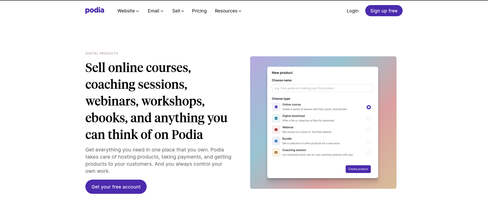

# <a href="https://www.podia.com/digital-products">Podia</a> Digital Products webpage clone</a>

## Webpage Design Using TailwindCSS

Tailwind CSS is a utility-first CSS framework that streamlines web development by providing a comprehensive set of pre-designed, low-level utility classes for building responsive and customizable user interfaces.

This is my learning journey with Tailwind CSS, which focuses on cloning the <a href="https://www.podia.com/digital-products">Podia</a> Digital Products webpage - a challenge found on <a href="https://www.frontendpractice.com/projects/podia">frontendpractice.com</a>

- **Podia live site** - <a href="https://www.podia.com/digital-products">podia.com/digital-products</a>
- **Podia clone** - 
